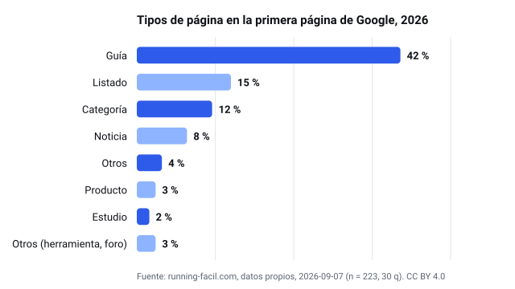
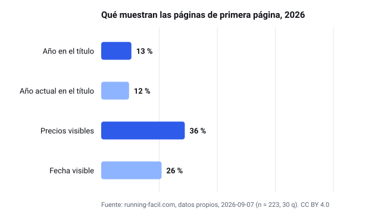
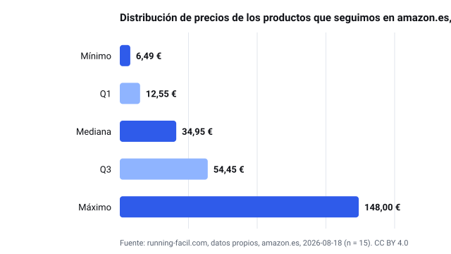
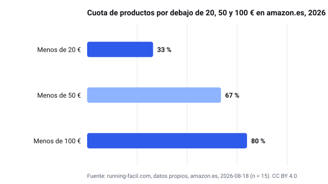

# Wellness network — open statistics datasets (CC BY 4.0)

Datos propios publicados por los sitios de la red (15 dominios) con licencia [CC BY 4.0](https://creativecommons.org/licenses/by/4.0/): agregados de precios en amazon.es y estudios de primera página de Google. Nunca precios por producto ni texto de terceros. Puedes reutilizar cifras y gráficos citando el sitio con un enlace a su página de estadísticas.

## Conjuntos de datos

### [Estadísticas de running en España 2026](https://running-facil.com/estadisticas/)

- Página con la versión vigente, el método («Cómo hemos contado») y la caja de cita: **[https://running-facil.com/estadisticas/](https://running-facil.com/estadisticas/)**
- Descargas (CSV/JSON) en el propio sitio: [https://running-facil.com/estadisticas/#descarga-datos](https://running-facil.com/estadisticas/#descarga-datos)
- Archivos en este repositorio:
  - [prices-2026.csv](running-facil.com/prices-2026.csv)
  - [prices-2026.json](running-facil.com/prices-2026.json)
  - [serp-2026.csv](running-facil.com/serp-2026.csv)
  - [serp-2026.json](running-facil.com/serp-2026.json)
  - [estudio-serp-2026.svg](running-facil.com/estudio-serp-2026.svg)
  - [estudio-serp-senales-2026.svg](running-facil.com/estudio-serp-senales-2026.svg)
  - [precios-2026.svg](running-facil.com/precios-2026.svg)
  - [precios-tramos-2026.svg](running-facil.com/precios-tramos-2026.svg)

## Calculadoras gratuitas de la red

Cada una tiene un fragmento «Insertar» con el enlace visible a la fuente.

- [acero-inoxidable.co/herramientas/calculadora-peso-acero/](https://acero-inoxidable.co/herramientas/calculadora-peso-acero/)
- [ayuno-intermitente.com/herramientas/calculadora-ventana-ayuno/](https://ayuno-intermitente.com/herramientas/calculadora-ventana-ayuno/)
- [dieta-mediterranea.org/herramientas/test-medas/](https://dieta-mediterranea.org/herramientas/test-medas/)
- [guia-cafe.com/herramientas/calculadora-ratio-cafe/](https://guia-cafe.com/herramientas/calculadora-ratio-cafe/)
- [guia-luz-azul.com/herramientas/hora-apagar-pantallas/](https://guia-luz-azul.com/herramientas/hora-apagar-pantallas/)
- [keto-keto.com/herramientas/calculadora-macros-keto/](https://keto-keto.com/herramientas/calculadora-macros-keto/)
- [luz-roja.com/herramientas/calculadora-dosis-luz-roja/](https://luz-roja.com/herramientas/calculadora-dosis-luz-roja/)
- [mejoresvitaminas.com/herramientas/calculadora-ingesta-vitamina-c/](https://mejoresvitaminas.com/herramientas/calculadora-ingesta-vitamina-c/)
- [piscinasal.com/herramientas/calculadora-sal-piscina/](https://piscinasal.com/herramientas/calculadora-sal-piscina/)
- [running-facil.com/herramientas/calculadora-ritmo/](https://running-facil.com/herramientas/calculadora-ritmo/)
- [sal-marina.com/herramientas/conversor-sal-sodio/](https://sal-marina.com/herramientas/conversor-sal-sodio/)
- [te-matcha.com/herramientas/calculadora-dosis-matcha/](https://te-matcha.com/herramientas/calculadora-dosis-matcha/)

## Directorios locales por provincia

Cada sitio publica un directorio de negocios por provincia y municipio (datos de Google Maps, ordenados por reseñas, sin pago). Cada ficha ofrece un distintivo «recomendado en <ciudad>» que el negocio puede insertar en su web.

- [acero-inoxidable.co/provincias/](https://acero-inoxidable.co/provincias/)
- [ayuno-intermitente.com/provincias/](https://ayuno-intermitente.com/provincias/)
- [guia-cafe.com/provincias/](https://guia-cafe.com/provincias/)
- [guia-luz-azul.com/provincias/](https://guia-luz-azul.com/provincias/)
- [mejoresvitaminas.com/provincias/](https://mejoresvitaminas.com/provincias/)
- [piscinasal.com/provincias/](https://piscinasal.com/provincias/)
- [running-facil.com/provincias/](https://running-facil.com/provincias/)
- [te-matcha.com/provincias/](https://te-matcha.com/provincias/)
- [gafasrojas.com/provincias/](https://gafasrojas.com/provincias/)

## Licencia y cita

CC BY 4.0. Atribución: «<nombre del sitio> — <URL de la página de estadísticas>». Cada CSV lleva una fila por métrica (`metric,value,n,unit,retrievedAt,method`); cada JSON es el agregado completo con el método y la fecha de la instantánea. Los gráficos SVG se generan a partir de estos archivos, nunca de la prosa.
